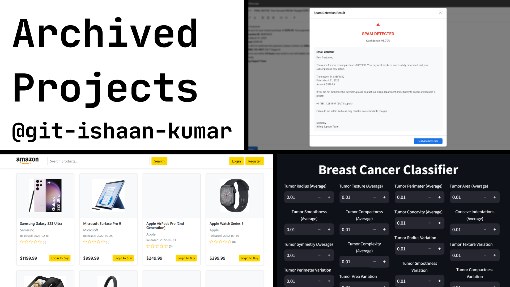

# Archived Projects

This repo contains old data science and ML projects from my previous GitHub account.
## Projects
- **Amazon Clone** - This project is a clone of Amazon built using Flask, a lightweight Python web framework. The website replicates core functionalities of Amazon.com, providing users with a familiar e-commerce experience. Users can create accounts, browse products, manage their shopping carts, place orders, and write product reviews.
- **Breast Cancer Classification** - Predicts tumors to be benign or malignant, with classifiers such as ``Logistic Regression``, ``K Nearest Neighbors``, ``Support Vector Machine``, ``Decision Tree``, ``Random Forest``, ``Gradient Boosting``, and ``Gaussian Naive Bayes``.
- **Fuel Efficiency** - Predicts fuel efficiency of a car using Tensorflow.
- **House Price Regression** - Predicts house prices in Ames, Iowa using various regression techniques such as ``Linear Regression``, ``Ridge Regression``, ``Lasso Regression`` ``ElasticNet Regression``, ``Decision Tree Regression``, Random Forest Regression``, ``Gradient Boosting Regression``, ``AdaBoost Regression``, ``K-Nearest Neighbors Regression``, ``Support Vector Regression (SVR)``, ``XGBoost Regression``, ``LightGBM Regression``, and ``CatBoost Regression``.
- **Loan Approval Classification** - Predicts if a loan will be accepted or rejected based on input data.
- **Spam Email Detection** - A natural language processing project that detects if a given email is spam or not spam (ham).

## Notes
- For **Spam Email Detection**, the dataset did not successfully transfer over. 